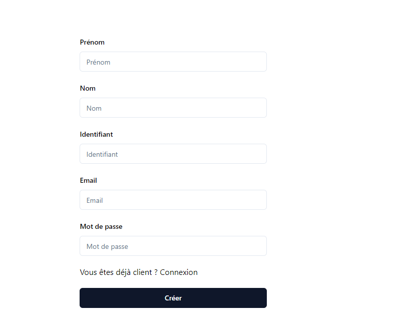
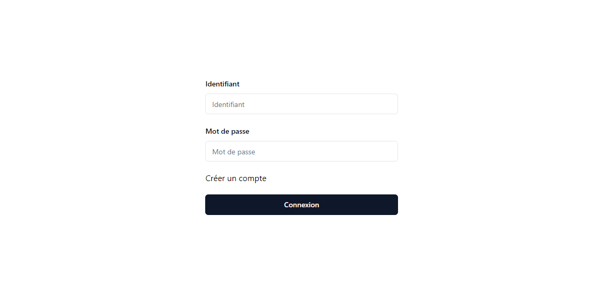
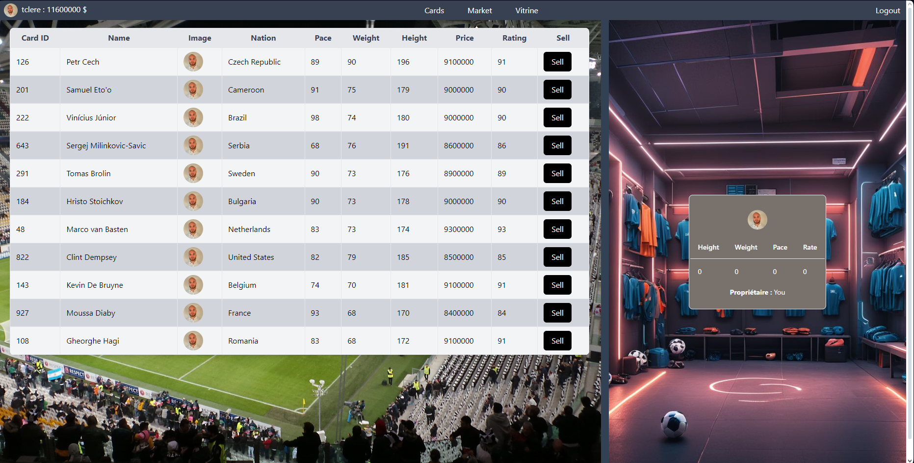
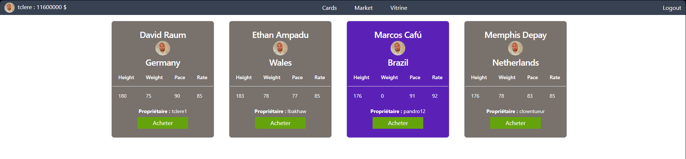
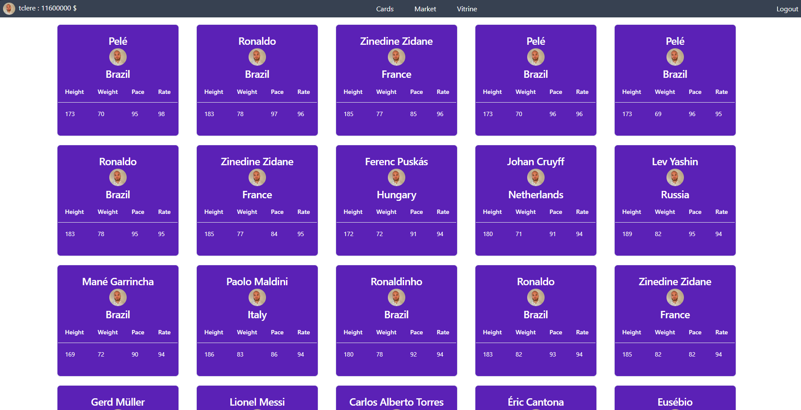

### PULIEN_Atelier2

# Atelier n°2 du module de WebDynamique - Microservices

## Contributeurs :
* Théo CLERE
* Maxime BROSSARD
* Sandro SPINA
* Ceif-Edine MAROUANI
* Julien BUC

L'application web présenté dans ce git est une plateforme d'achat/vente des cartes Fifa.

# Fonctionnalités

- Création de compte utilisateur

- Connexion

- L'**inventaire** permet à l'utilisateur connecté de consulter la liste de cartes qu'il possède 

- Le **Market Place** liste les cartes que l'utilisateur connecté peux acheter

- La page **Vitrine** montre toutes les cartes disponnibles de notre application

# Structure du Projet

## Frontend

La partie front end à été réalisée en à l'aide du framework javascript React. (dans le dossier /front)

## Backend

Le server Spring se décompose en plusieurs module nécessaire au bon fonctionnement de notre application:
- AuthManager : composant responsable de l'authentification (JWT Token).
- UserManager : composant responsable de la gestion de utilisateurs.
- CardManager : composant responsable de la gestion des cartes.
- Persistence Layer : couche d'abstraction permettant de persister les données traités en base de données.

Voir les rapport .pdf pour en savoir plus.

